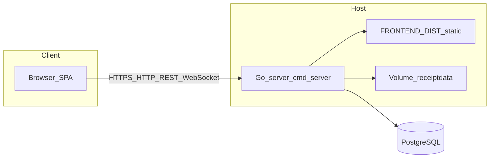
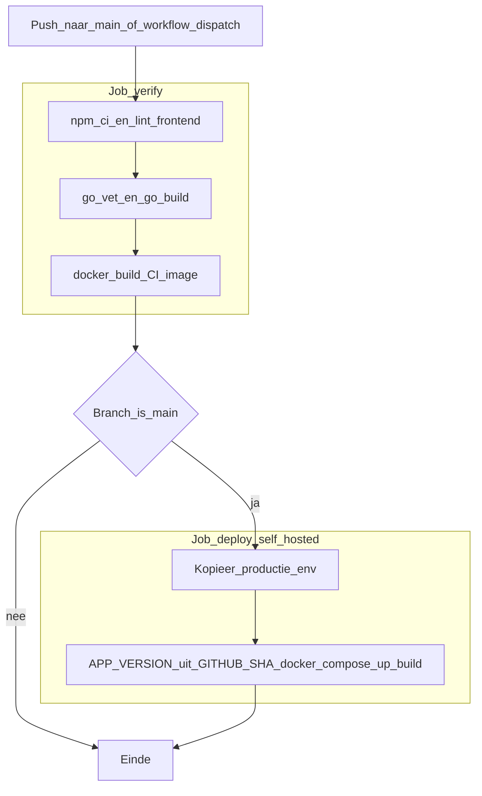
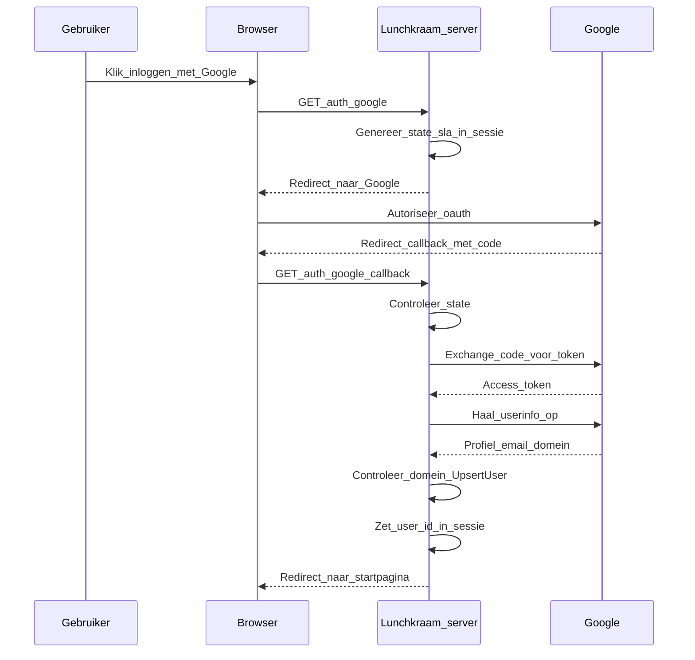
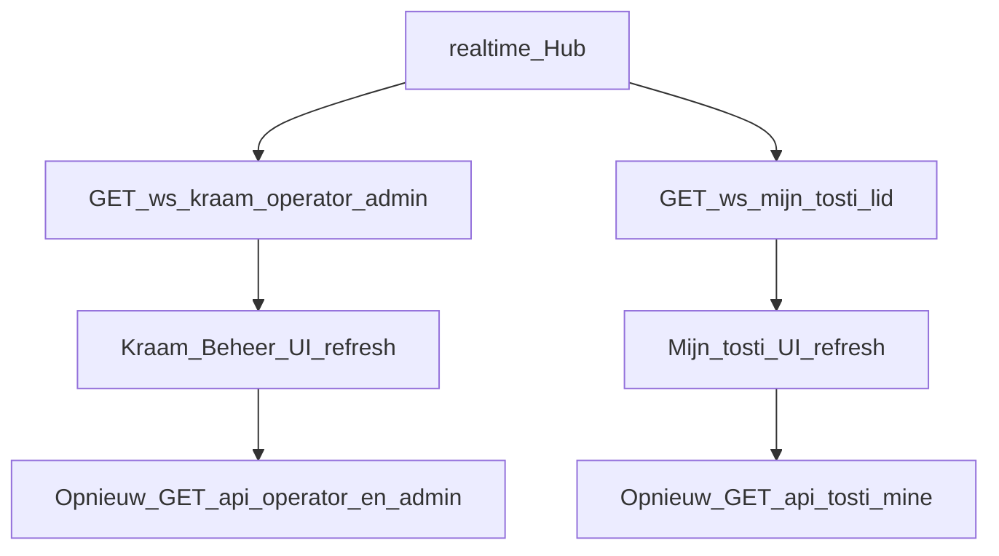
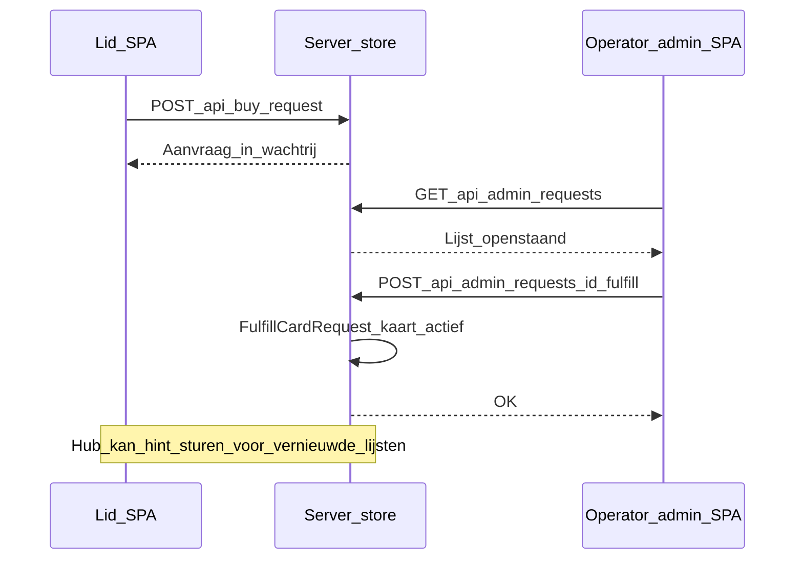

# Architectuur Lunchkraam

Dit document vult de [README](../README.md) aan met een beknopte technische uitleg en Mermaid-diagrammen. De bron voor API-routes blijft [`cmd/server/main.go`](../cmd/server/main.go).

## Code-indeling (backend en frontend)

- **`cmd/server`**: HTTP-server, routing, SPA-static files, migraties bij start.
- **`internal/config`**: Omgevingsvariabelen en defaults.
- **`internal/db`**: Postgres-verbinding en goose-migraties.
- **`internal/store`**: Database-queries en domeinlogica.
- **`internal/handlers`**: HTTP-handlers (REST + OAuth-callbacks + WebSocket-upgrade).
- **`internal/middleware`**: Sessie, CSRF-bescherming op `/api`, auth/rollen, rate limits.
- **`internal/auth`**: Google OAuth-config en profiel/domain-checks.
- **`internal/realtime`**: Hub voor WebSocket-“hints”.
- **`frontend/`**: React/Vite-SPA; [`frontend/src/api.ts`](../frontend/src/api.ts) + [`api.schemas.ts`](../frontend/src/api.schemas.ts) voor Zod-gevalideerde API-responses.

## Runtime en deployment (hoog niveau)

In productie draait één Go-binary die de gebouwde SPA uit `FRONTEND_DIST` serveert en tegelijk `/api` en `/ws` afhandelt. Postgres en bonfoto’s volgen uit [docker-compose.yml](../docker-compose.yml) en de [Dockerfile](../Dockerfile) (multi-stage: Node build → Go build → Alpine image).

## CI/CD

Bij push naar `main` (of handmatige dispatch) draait eerst de check-job op GitHub-hosted runners; daarna deploy op een self-hosted runner met Docker Compose. Zie [.github/workflows/deploy.yml](../.github/workflows/deploy.yml).

## Google OAuth en sessie

Inloggen met Google: state in de cookie-sessie, redirect naar Google, callback met code, token exchange, userinfo, domeincheck (`ALLOWED_GOOGLE_DOMAIN`), gebruiker upserten, `user_id` in sessie. Lokale accounts gebruiken een apart JSON-endpoint (`POST /api/auth/local/login`) met dezelfde sessie-cookie daarna.

## Realtime via WebSockets

De hub stuurt geen volledige payloads door de socket, maar **hints** om clients te laten weten dat ze relevante REST-endpoints opnieuw moeten ophalen. Twee paden: kraam (operator/admin) en “mijn tosti” (ingelogd lid).

## Voorbeelddomein: digitale kaart kopen

Een lid vraagt een kaart aan; een admin of operator accordeert in de betalingswachtrij. De server voltooit de aanvraag en legt o.a. het accorderingsbedrag vast. De UI parseert antwoorden met Zod (`api.schemas.ts`).

## Verder lezen

- Runbook en rollen: [README](../README.md)
- Omgevingsvariabelen: [.env.example](../.env.example)
